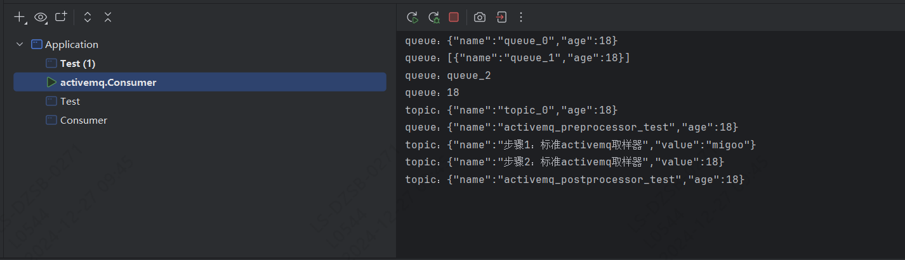

# Docker ActiveMQ 环境搭建

1. 拉取镜像

        docker pull apache/activemq-artemis:latest

2. 启动 Active

        docker run --detach --name same-active -p 61616:61616 -p 8161:8161 --rm apache/activemq-artemis:latest

3. 访问 web控制台，用户名密码：artemis

        http://localhost:8161

# 启动 Active Java 消费者

      启动 active-example 中的 Consumer

# 执行 Ryze Active 测试

      运行 active-example 中的 Test

# 执行结果

- Consumer 控制台打印 Active MQ Sampler 发送的 message

  