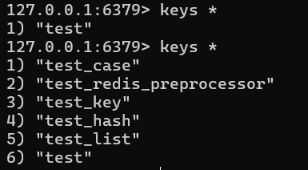

# Docker Redis 环境搭建

1. 拉取镜像

        docker pull redis

2. 启动 Redis，将容器 6379端口映射到宿主机 6379端口

        docker run -d -p 6379:6379 --name redis redis:latest

3. 在Redis 容器中打开一个 shell

        docker exec -it redis sh

4. 进入 redis 客户端控制台

        redis-cli

5. 创建key，并设置值

         set test redis_docker        

6. 查看 key 值

        get test

# 执行 Ryze Redis 测试

      运行 redis-example 中的 Test

# 执行结果

- Redis-cli 查看 keys *

  
