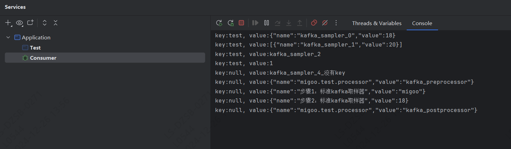

# Docker Kafka 环境搭建

1. 拉取镜像

        docker pull apache/kafka

2. 启动Kafka

        docker run -d -p 9092:9092 --name broker apache/kafka:latest

3. 在Kafka容器中打开一个 shell

        docker exec --workdir /opt/kafka/bin/ -it broker sh

4. 创建一个Topic

        ./kafka-topics.sh --bootstrap-server localhost:9092 --create --topic test-topic

5. 使用 Kafka 附带的控制台创建器将两个字符串事件写入主题

        ./kafka-console-producer.sh --bootstrap-server localhost:9092 --topic test-topic

6. 输入 Hello world，回车，然后 ctrl+c 退出控制台

7. 读取Topic中的事件

        ./kafka-console-consumer.sh --bootstrap-server localhost:9092 --topic test-topic --from-beginning

# 启动 Kafka Java 消费者

      启动 kafka-example 中的 Consumer

# 执行 MiGoo Kafka 测试

      运行 kafka-example 中的 Test

# 执行结果

- Consumer 控制台打印 Kafka Sampler 发送的 message

  
- 项目根目录下生成 out-put，并保存HTML 报告

  