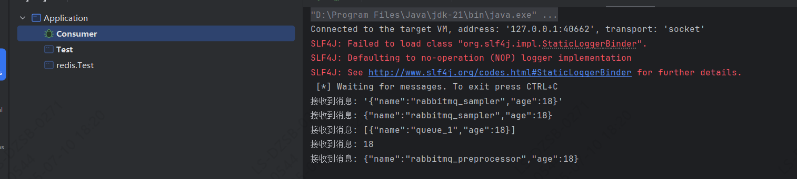
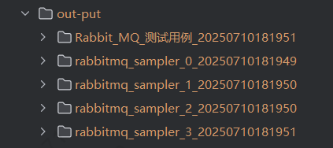

# Docker RabbitMQ 环境搭建

1. 拉取镜像

        docker pull rabbitmq:management

2. 启动 RabbitMQ

        $ docker run -d -p 5672:5672 -p 15672:15672 --hostname my-rabbit --name rabbit rabbitmq:management

3. 访问 web控制台，用户名密码：guest

        http://localhost:15672

# 启动 RabbitMQ Java 消费者

      启动 rabbit-example 中的 Consumer

# 执行 MiGoo RabbitMQ 测试

      运行 rabbit-example 中的 Test

# 执行结果

- Consumer 控制台打印 Rabbit MQ Sampler 发送的 message

  
- 项目根目录下生成 out-put，并保存HTML 报告

  